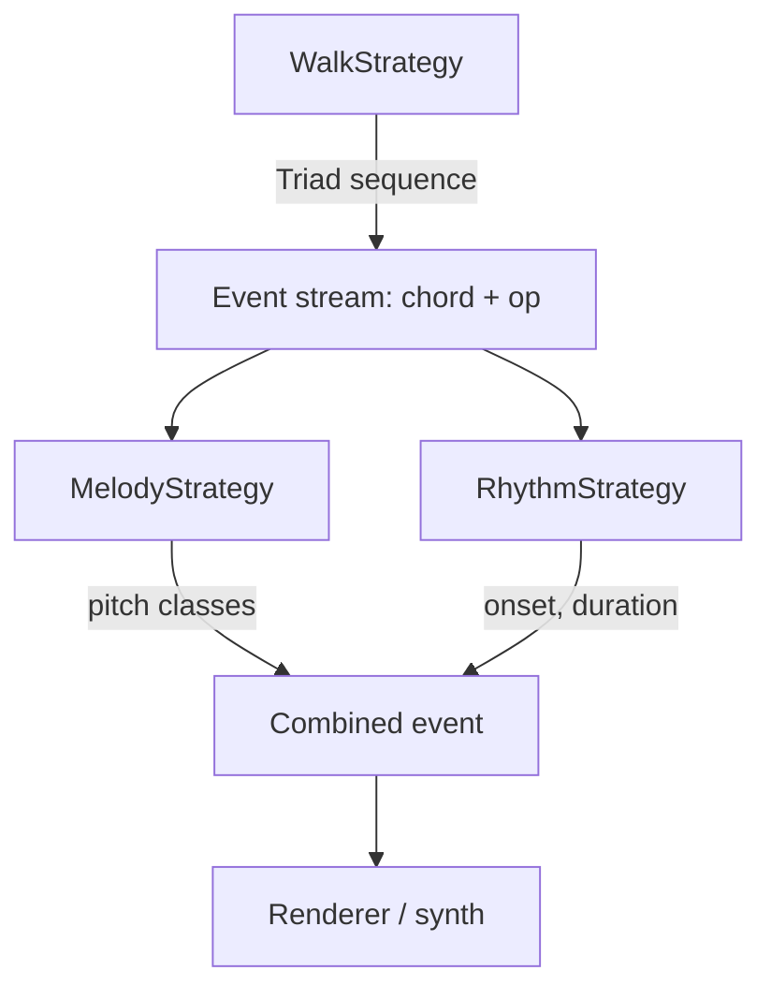

# Procedural harmony/melody/rhythm generator — design sketch

Generates chord progressions by walking a graph of neo-Riemannian triadic transformations (Cohn, "Introduction to
Neo-Riemannian Theory," 1998), then derives melody and rhythm from the same walk. Target language: Rust.

This is a design sketch, not a spec — flag anything that seems wrong or underspecified rather than silently resolving
it.

## 1. Core types

```rust
#[derive(Clone, Copy, PartialEq, Eq, Hash, Debug)]
pub struct PitchClass(pub u8); // 0-11, 0 = C

#[derive(Clone, Copy, PartialEq, Eq, Hash, Debug)]
pub enum Mode { Major, Minor }

#[derive(Clone, Copy, PartialEq, Eq, Hash, Debug)]
pub struct Triad {
    pub root: PitchClass, // the triad's root, regardless of mode
    pub mode: Mode,
}
```

24 possible `Triad` values total (12 roots × 2 modes).

## 2. The P, L, R transformations

Each is an involution (applying it twice is the identity) and moves exactly one voice by step while holding the other
two pitch classes fixed:

| Op | Name                  | Fixed edge         | Moving voice |
|----|-----------------------|--------------------|--------------|
| P  | Parallel              | perfect-fifth edge | semitone     |
| L  | Leading-tone exchange | minor-third edge   | semitone     |
| R  | Relative              | major-third edge   | whole step   |

Verified formulas (root arithmetic mod 12):

```
P(root, Major) = (root,       Minor)
P(root, Minor) = (root,       Major)

L(root, Major) = (root + 4,   Minor)
L(root, Minor) = (root - 4,   Major)

R(root, Major) = (root + 9,   Minor)   // == root - 3
R(root, Minor) = (root + 3,   Major)
```

Checked against Cohn's worked examples: `L(C minor) = Ab major`,
`R(C minor) = Eb major`, `P(C major) = C minor`. Write a unit test per row before trusting this table.

**Implemented as:** rather than three separate hand-written functions, the
`tonnetz-core` crate implements P/L/R as three named instances of a single
`Utt` type -- Hook's uniform triadic transformation, `<sign, m, n>` (Hook,
"Uniform Triadic Transformations," Journal of Music Theory 46, 2002; see docs/ for papers covering it). This is a strict
superset of PLR (order 288 vs. 24), so non-Riemannian moves -- the `D` operation below, or others -- can be added later
as more `Utt` values without changing the type.

There's a fourth operation, D (dominant), but it's redundant — it's a composition of L and R (transposition by a fifth,
same mode). Don't implement it separately; derive it if it's ever needed, and confirm the exact composition order and
direction against the P/L/R formulas above with a test, since the two modes may transpose in opposite directions
(Riemann's "dualism") — this sketch doesn't pin that down.

## 3. The triad graph

- 24 nodes, 3-regular (every triad has exactly one P-neighbor, one L-neighbor, one R-neighbor) — 36 edges total.
- The group generated by {P, L, R} is dihedral of order 24 and acts simply transitively on the 24 triads (it's generated
  by L and R alone).
- Composite move orders — these determine cycle lengths and are worth encoding as constants/tests, not just prose:
    - `PL` / `LP` has order 3 → alternating L and P is a **closed 6-cycle**
      (a *hexatonic system*). 4 distinct hexatonic systems exist.
    - `PR` / `RP` has order 4 → alternating P and R is a **closed 8-cycle**
      (an *octatonic system*). 3 distinct octatonic systems exist.
    - `RL` / `LR` has order 12 → alternating only L and R is a **Hamiltonian cycle**: all 24 triads exactly once,
      returning home after 24 steps.
- A hexatonic system's pitch content is exactly the augmented-scale collection its triads are built from; an octatonic
  system's is the diminished-scale collection. Staying on one cycle means the current legal "scale" is just that fixed
  collection.
- Crossing from one cycle to an adjacent one (using the operation that *isn't* one of the cycle's two defining ops) is
  *system modulation* — the closest analogue to a key change in this framework.

## 4. Walk strategies

A walk strategy is anything implementing:

```rust
pub trait WalkStrategy {
    /// Returns the next triad and the operation used to reach it --
    /// melody strategies need the op, not just the resulting triad (see
    /// section 5), and returning only `Triad` would leave the caller to
    /// reconstruct the op by diffing consecutive triads.
    fn next(&mut self, current: Triad, history: &[Triad]) -> (Triad, Utt);
}
```

(Resolved while implementing: earlier drafts of this sketch had `next`
return just `Triad` and had `MelodyStrategy::notes` take an undefined
`PlrOp` parameter that was never introduced anywhere in this document.
`Utt`, from section 2's "Implemented as" note, supersedes the never-defined `PlrOp` and is used consistently in both
signatures below.)

Strategies to implement:

- **`FreeWalk`** — random choice among {P, L, R}, forbidding the op just used (since P/L/R are involutions, that's
  equivalent to forbidding immediate return to the previous node).
- **`WindowedTabuWalk { window: usize }`** — forbid revisiting any of the last `window` triads. `window = 1` reduces to
  `FreeWalk`. Needs a fallback rule for when all 3 neighbors are tabu (only 3 neighbors per node, so this happens for
  `window >= 3`) — e.g. relax to the least-recently-visited neighbor.
- **`SelfAvoidingWalk { length: usize }`** — `window = ∞` version, for a fixed number of steps. Not guaranteed to be
  extendable indefinitely without a fallback (dead ends are possible on a 3-regular graph); decide fallback behavior
  (backtrack? relax? stop early?).
- **`HamiltonianCycleWalk`** — the alternating-L/R walk from §3. Simplest strategy to implement (no state beyond a step
  counter and last-op) and guaranteed to visit all 24 triads with no repeats, returning home at step 24.
- **`CycleConfinedWalk { escape_probability: f32 }`** — stay on the current hexatonic or octatonic cycle (alternate its
  two defining ops)
  until a random escape fires, then take the third op once to modulate onto an adjacent system, and continue.
- **`DeBruijnWalk { order: usize }`** — apply a de Bruijn sequence over the 3-symbol alphabet {P, L, R} (length
  `3^order`) as the move sequence, so every possible length-`order` move pattern occurs exactly once before the sequence
  cycles. Decide whether to filter out self-canceling subsequences (e.g. "PP") from the source alphabet, or let them
  stand as an intentional "hold the chord" gesture.
- **`EulerianRouteWalk`** — cover all 36 edges (every distinct parsimonious move) rather than all 24 nodes. Note: a true
  Eulerian circuit doesn't exist here, since all 24 vertices have odd degree (3). This needs the Route Inspection /
  Chinese Postman approach: minimum- weight-match the odd-degree vertices, duplicate those edges to force even parity,
  then take the Eulerian circuit of the resulting multigraph. The matching step is the only non-trivial algorithm in
  this whole document — a full min-weight perfect matching is probably overkill for 24 nodes; a greedy or brute-force
  matching is likely fine given the small, fixed graph.

## 5. Melody strategies

```rust
pub trait MelodyStrategy {
    /// Called once per walk step, given the transformation just applied
    /// and every triad visited before `next` (so `prev == *history.last()
    /// .unwrap()` after the first step). `history` was missing from the
    /// original sketch of this trait, which left no way to implement
    /// RollingWindowScale below; added to mirror WalkStrategy::next.
    fn notes(&mut self, prev: Triad, next: Triad, op: Utt, history: &[Triad]) -> Vec<PitchClass>;
}
```

- **`MovingVoice`** — every P/L/R step already defines exactly one voice that moves by step; that note, tracked across
  the walk, is a complete, correctly-voiced melodic line with no extra logic needed. This is the cheapest strategy and
  should probably be the default.
- **`TightScale`** — the current triad's 3 notes only (arpeggio, harmonically locked to the current chord).
- **`RollingWindowScale { window: usize }`** — union of pitch classes across the last `window` triads. Reuses the same
  `window` concept as
  `WindowedTabuWalk` — consider sharing the parameter so the melodic palette widens/narrows in step with how far the
  harmonic walk is ranging.
- **`SystemFixedScale`** — when a `CycleConfinedWalk` is active, the current hexatonic/octatonic collection (§3). Only
  meaningful paired with that walk strategy. **Implemented**: rather than polluting
  `MelodyStrategy::notes`'s own parameters (a single `(prev, next, op)`
  step or the triad history alone can't disambiguate the current system, since `op = P` alone appears in both), both
  `WalkStrategy` and
  `MelodyStrategy` gained a matching default no-op method --
  `WalkStrategy::current_system() -> Option<System>` and
  `MelodyStrategy::set_system(System)` -- so `Pipeline` (§7) can bridge them generically each step without knowing
  either strategy's concrete type: only `CycleConfinedWalk` overrides the former, only
  `SystemFixedScale` overrides the latter, and every other strategy is unaffected. The 6/8-note collection itself turned
  out not to need tracking "which of the 4 hexatonic / 3 octatonic systems" separately:
  `triad.root mod 4` (hexatonic) / `mod 3` (octatonic) is invariant under that system's own two defining ops, so
  `System::pitch_classes(Triad)`
  derives it from the current triad alone.

## 6. Rhythm strategies

Kept as a separate axis — a walk step is an *event* (chord + melody notes), and rhythm decides when events actually
sound. Don't couple this to the walk logic above.

```rust
pub trait RhythmStrategy {
    /// Given the event index, return its onset time and duration.
    fn timing(&mut self, event_index: usize) -> (f64 /* onset */, f64 /* dur */);
}
```

- **`FixedPulse { beat: f64 }`** — one event per beat. Simplest baseline.
- **`Euclidean { pulses: usize, steps: usize }`** — standard Euclidean rhythm generator (Bjorklund's algorithm;
  Toussaint, "The Euclidean Algorithm Generates Traditional Musical Rhythms," 2005), reused as a duration/onset pattern:
  each of the `pulses` onsets becomes one event, onset = its absolute slot position (in units of one step), duration =
  the gap to the next onset, cycling every `steps` units.
- **`WindowedDurations { window: usize, palette: Vec<f64> }`** — its own small tabu/de-Bruijn-style process over a
  duration palette, independent of the harmonic walk's window — deliberately not reusing the harmonic
  `window` parameter here, since rhythmic and harmonic pacing are probably not the same thing (open question — see §8).

## 6a. Fill strategies (melodic subdivision)

Not in the original sketch — added once the chord and melody voices always retriggering in lockstep at each
`RhythmStrategy`-timed beat started feeling too rigid: the melody wanted a faster, independent pattern of its own in the
gaps between main beats (e.g. chord on beats 1 and 3, melody matching that *and* adding two extra arpeggiated notes on
beats 2 and 4) — a counter-rhythm/subdivision layered on top, not a new main pulse.

```rust
pub trait FillStrategy {
    /// Given the triad the main event just arrived at, and that event's
    /// own onset-to-onset duration, return 0+ extra notes to interleave
    /// before the next main event -- each paired with its onset as a
    /// fraction of `duration`, strictly in (0.0, 1.0), ascending.
    fn fills(&mut self, triad: Triad, duration: f64) -> Vec<(f64, PitchClass)>;
}
```

Kept as a *separate* axis from `RhythmStrategy` rather than folded into it, because the chord and melody need
independently shrinkable durations within one main step — a single shared `(onset, duration)` per step (all
`RhythmStrategy` produces) can't express "the chord keeps ringing for the full beat, but the melody's own note stops
early so a fill can take over before the next chord change."

- **`NoFill`** — no subdivision; today's original lockstep behavior. The default/off option.
- **`ArpeggioFill { count: usize }`** — arpeggiates the current triad's other tones (cycling third, fifth, root, ...) at
  `count` evenly-spaced points in the gap.

**Implemented as:** `Pipeline` gained a 4th type parameter, `F: FillStrategy`
(`Pipeline<W, M, R, F>`), and an internal pending-fills queue. Each main event is still emitted as before, except its
own `duration` is *shrunk* to reach only the first fill (or left untouched if there are none), and the fill notes are
queued as ordinary-looking extra `Event`s (a new
`Event::is_fill: bool` marks them, `op: Utt::IDENTITY` since the walk didn't move) with durations chained legato through
to the next main event. This is why no changes were needed to `tonnetz-cli`'s driving loop or to any `Renderer`'s timing
math: fills are just more events in the same flat stream, and the loop already paces strictly off each event's own
`duration`. Only `VoiceTracker` needed a new method,
`advance_fill(pitch) -> NoteChange`, which moves the melody voice the same way `advance` does but leaves the chord's
`NoteChange` fields `None` since a fill never touches the chord.

## 7. Pipeline



`WalkStrategy` and `MelodyStrategy` share the triad/op sequence;
`RhythmStrategy` only needs an event count. All three are swappable independently — a config is just "pick one of each."

**Implemented as:** this diagram never specified how the three strategies actually get driven together or what a
"Renderer" looks like, so `tonnetz-core::Pipeline<W, M, R, F>` and `tonnetz-core::Renderer`
are new rather than a transcription of something already in this doc:

```rust
pub struct Event {
    pub triad: Triad,
    pub op: Utt,
    pub notes: Vec<PitchClass>,
    pub onset: f64,
    pub duration: f64,
    pub is_fill: bool, // set by FillStrategy-produced events (section 6a)
}

// Pipeline<W: WalkStrategy, M: MelodyStrategy, R: RhythmStrategy, F: FillStrategy>
// implements Iterator<Item = Event>, driving all four together.

pub trait Renderer {
    fn start(&mut self, triad: Triad) {}     // default no-op
    fn render(&mut self, event: &Event);
    fn finish(&mut self) -> Result<(), Box<dyn std::error::Error>> { Ok(()) } // default no-op
    fn wants_realtime_pacing(&self) -> bool { true } // default: sleep between events
}
```

`Pipeline` is an `Iterator`, not a `Vec<Event>` builder -- see the now-resolved streaming-vs-offline question below.
`start`/`finish`/
`wants_realtime_pacing` were added once a second `Renderer` (file output, not just live sound) showed up -- see section
8's "Output target" bullet for why and what they enable. `tonnetz-core::
VoiceTracker` factors the actual "which notes turn off, which turn on" state machine out of any one `Renderer`, shared
by every backend below. `tonnetz-cli`'s `main.rs` builds a
`Pipeline<AnyWalk, AnyMelody, AnyRhythm, AnyFill>` (each axis randomly picked from the seed, per
`tonnetz-cli::random_pipeline`) and feeds it to whichever `Renderer` `--backend` selects -- the first real use of every
layer in this document at once.

## 8. Open questions for implementation

- Real-time generation (stream events as they're computed) vs. offline (generate N events, then render) — affects
  whether strategies need to be lazy/iterator-based or can just build a `Vec<Triad>` upfront. **Resolved:** `Pipeline`
  implements `Iterator<Item = Event>` and computes one event per `.next()` call, lazily -- chosen because
  `WalkStrategy` has no natural end (`FreeWalk` can run forever), so an eager `Vec`-building API couldn't represent it.
  An offline consumer can still get a batch via `.take(n).collect()`.
- Whether `RhythmStrategy` should ever be allowed to read the harmonic walk's state (e.g. slow down at a
  system-modulation event) or stay fully decoupled as sketched above.
- Fallback behavior for dead ends in `WindowedTabuWalk` /
  `SelfAvoidingWalk` — pick one approach and use it consistently rather than deciding per-strategy.
- Output target: raw event list, MIDI, or directly driving a synthesis backend — determines what `notes()` and
  `timing()` should actually return (pitch classes vs. absolute frequencies/octaves, for one). **Resolved:** `notes()`/
  `timing()` stay abstract (pitch classes, onset/duration in caller-chosen units) regardless of output target -- turning
  that into real MIDI note numbers, and real MIDI note numbers into an actual output, is entirely a `Renderer`'s job,
  not the strategies'. `tonnetz_core::{triad_midi_notes, nearest_midi_note,
  VoiceTracker}` do the pitch-class-to-MIDI-note math and the stop-old/start-new voice-leading state machine once,
  shared by every backend below, so the "MIDI, or synthesis backend, or raw event list"
  question turned out not to be an either/or: there are now four interchangeable `Renderer`s, selected via
  `tonnetz-cli --backend`:
    - `tonnetz_sound::SynthRenderer` -- live playback via rustysynth + cpal (the original implementation).
    - `tonnetz_sound::WavRenderer` -- drives the same rustysynth
      `Synthesizer` offline (no cpal stream), rendering block-by-block into a buffer written out as a 32-bit-float
      `.wav` at `finish()`.
    - `tonnetz_midi::MidiRenderer` -- a new crate; buffers absolute-tick MIDI events and writes a real `.mid` Standard
      MIDI File via
      `midly` at `finish()`, with a tempo meta-event derived from the same `unit_seconds` the live backend uses for
      pacing, so the perceived tempo doesn't change across backends.
    - `tonnetz-cli::TextRenderer` -- the plain progression trace this CLI always printed, now a real `Renderer` instead
      of inline
      `print!` calls in `main.rs`. File-writing backends (`WavRenderer`, `MidiRenderer`) override
      `Renderer::wants_realtime_pacing` to `false`: they encode timing into the output itself via `event.onset`/
      `event.duration` and run as fast as possible rather than sleeping in real time like the live backends do.
      `tonnetz-cli`'s `main.rs` is the first real caller: it builds a
      `Pipeline<FreeWalk, MovingVoice, Euclidean>` and drives whichever
      `Renderer` `--backend` selects through one generic loop (section 7).